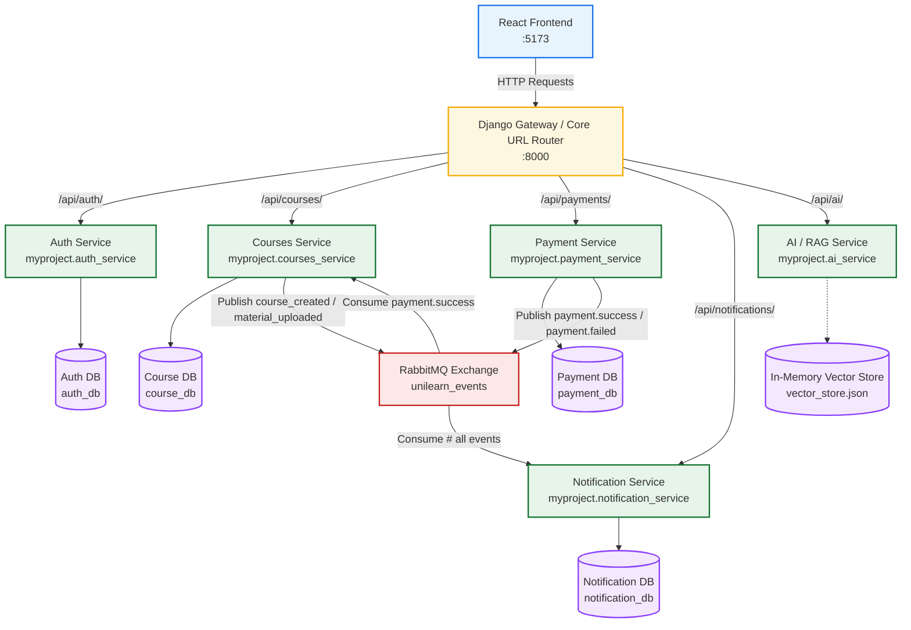
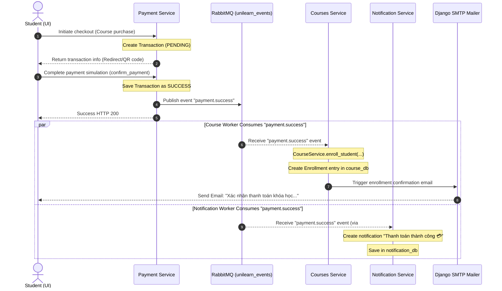
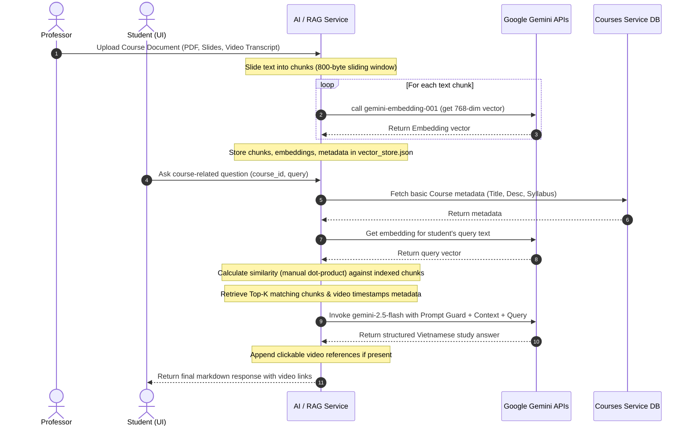

# UniLearn Microservices Architecture & System Workflows

This document provides a comprehensive technical overview of the **UniLearn** Microservices Learning Portal backend. It maps out the architecture, the multi-database setup, asynchronous event-driven integrations, and core system workflows (including enrollment checkout and the AI-driven RAG study assistant).

---

## 🏛️ Microservices Architecture Overview

UniLearn is designed as a **modular Django monolith** acting as a set of logical microservices. Each service manages its own business logic, database models, and service interfaces, communicating asynchronously via a **RabbitMQ Topic Exchange**.

### 💾 Multi-Database Routing
To isolate services at the database tier, UniLearn utilizes Django's `DatabaseRouter` (`config/db_router.py`), mapping database interactions dynamically based on Django `app_label`:
* **Auth Service** (`app`) ➔ `default` database (`auth_db` MySQL)
* **Courses Service** (`courses_service_app`) ➔ `courses` database (`course_db` MySQL)
* **Notification Service** (`notification_service_app`) ➔ `notifications` database (`notification_db` MySQL)
* **Payment Service** (`payment_service`) ➔ `payments` database (`payment_db` MySQL)

---

## 🔄 Core System Workflows

### 💳 1. Payment & Automated Enrollment Workflow (Event-Driven)
When a student purchases a course, the transaction flows asynchronously across three services, coordinated via RabbitMQ. This ensures high availability and fast user responses.

---

### 🧠 2. AI RAG Study Assistant Workflow (Retrieval-Augmented Generation)
The system leverages Google Gemini to answer questions using only indexed course files and includes clickable timestamps referencing exact video segments.

---

## ⚡ Technical Service Map

### A. Auth Service (`myproject/auth_service/`)
* **Database**: `auth_db`
* **Models**: `User` (Stores usernames, emails, salted passwords, and system roles: Student, Professor).
* **Capabilities**: Signs and verifies JWT security tokens using `python-jose` for user verification.

### B. Courses Service (`myproject/courses_service/`)
* **Database**: `course_db`
* **Models**: `Course`, `Material` (video_url, file), `Enrollment` (progress, course, student), `Announcement`, `Assignment`, `Submission`.
* **Capabilities**: Handles catalog creation, progress updates, enrollment registers, and triggers confirmation emails.

### C. Payment Service (`myproject/payment_service/`)
* **Database**: `payment_db`
* **Models**: `Transaction` (amount, payment_method, status: PENDING, SUCCESS, FAILED).
* **Capabilities**: Simulates payment collection and publishes event hooks to RabbitMQ.

### D. Notification Service (`myproject/notification_service/`)
* **Database**: `notification_db`
* **Models**: `Notification` (user_id, title, message, read status).
* **Capabilities**: Concurrently processes messages, creating alerts in the background.

### E. AI Service (`myproject/ai_service/`)
* **Storage**: `vector_store.json` (in-memory document matrix).
* **APIs**: Google Gemini REST APIs (`gemini-2.5-flash` for generation, `gemini-embedding-001` for embedding representation).
* **Capabilities**: Auto-indexes text, calculates vector similarity, and acts as a strict, course-scoped Q&A tutor.
